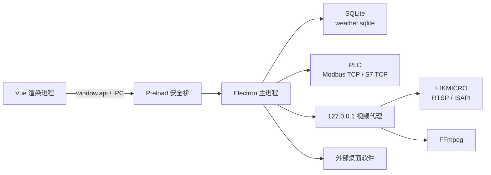

# 能源调控中心技术文档

> 文档版本：1.0  
> 整理日期：2026-07-14  
> 适用范围：当前仓库工作区代码

## 1. 文档目的

本文档面向开发、测试、部署和现场联调人员，说明“能源调控中心”桌面软件的系统架构、模块职责、数据存储、进程间通信、PLC 与摄像头接入、构建发布方式，以及当前实现边界。

## 2. 软件概述

能源调控中心是一套跨平台 Electron 桌面应用，用于集中展示和维护能源场景中的天气、发电、用电、PLC 实时数据、设备状态和视频监控信息。

当前主要能力包括：

- 全屏能源监控总览；
- 天气数据、24 小时发电量和能耗占比的本地维护；
- 通过 Modbus TCP 或 S7 原生读取 PLC 点位；
- 通过 Modbus TCP 向 PLC 写入天气、车流量和仪表盘日期；
- 通过本地 HTTP 代理接入 HIKMICRO RTSP 或 ISAPI 快照；
- 配置并启动一个外部桌面软件；
- Windows、macOS 和 Linux 安装包构建。

### 2.1 当前“AI 预测”的实现口径

界面包含“AI 能源预测”和“AI 设备状态预测”等名称，但当前代码没有加载机器学习模型，也没有调用远程推理服务。

- 预测发电量：直接读取所选天气记录对应的 24 小时 `generation_kwh_records` 数据；
- 预测用电量：`PLC 系统总功率（换算为 kW） × 小时能耗占比 ÷ 100`；
- 设备状态预测：根据 PLC 点位值与前端固定阈值计算“正常 / 关注 / 预警”；
- 天气预测：按季节和起始日从本地天气样本中循环取数，并非气象算法预测。

若项目目标包含真实 AI 推理，应另行增加模型服务、特征处理、模型版本管理、推理结果持久化和效果评估能力。

## 3. 技术栈

| 层级 | 技术 | 作用 |
| --- | --- | --- |
| 桌面容器 | Electron 39 | 主进程、窗口、系统能力、打包 |
| 构建工具 | electron-vite 5、Vite 7 | 主进程、预加载脚本和渲染进程构建 |
| 前端框架 | Vue 3、TypeScript 5 | 页面和业务交互 |
| 路由 | Vue Router 5 | Hash 路由 |
| UI | Element Plus、Tailwind CSS 4 | 组件和样式 |
| 图表 | ECharts 6 | 发电量、用电量趋势图 |
| 数据库 | SQLite、better-sqlite3 | 天气、能耗占比、发电量本地存储 |
| PLC | modbus-serial、Node `net` | Modbus TCP；S7 原生 TCP 读取 |
| 视频 | FFmpeg、Node HTTP | RTSP 转 MJPEG；ISAPI 快照代理 |
| 打包 | electron-builder 26 | Windows、macOS、Linux 发布物 |

`serialport` 当前指向 `stubs/serialport`，用于满足依赖解析；现有业务只使用 TCP 通信，不提供串口 PLC 通信。

## 4. 总体架构



### 4.1 Electron 进程分工

- 主进程 `src/main/index.ts`
  - 创建主窗口；
  - 注册所有 IPC；
  - 启动摄像头代理；
  - 管理窗口全屏状态；
  - 退出前停止视频代理、PLC 轮询并关闭数据库。
- 预加载脚本 `src/preload/index.ts`
  - 通过 `contextBridge` 暴露受控的 `window.api`；
  - 渲染进程不直接访问 Node.js 或 Electron 主进程对象。
- 渲染进程 `src/renderer/src`
  - Vue 页面、数据展示、表单、图表和交互；
  - 仅通过 `window.api` 调用主进程能力。

主窗口最小尺寸为 `900 × 670`，启动后自动最大化。开发环境加载 Vite 地址，生产环境加载构建后的本地 HTML。

## 5. 目录结构

```text
AI-Prediction/
├── build/                         # 安装包图标、权限文件、FFmpeg 二进制
├── docs/                          # 项目技术文档
├── resources/                     # 运行时资源
├── scripts/
│   └── plc-protocol-probe.mjs     # PLC 协议和端口探测脚本
├── src/
│   ├── main/
│   │   ├── database/              # SQLite 仓储、IPC、种子数据
│   │   ├── camera.ts              # 摄像头代理和 IPC
│   │   ├── externalApp.ts         # 外部程序配置与启动
│   │   ├── index.ts               # Electron 主进程入口
│   │   └── plc.ts                 # PLC 读取、写入、轮询和 IPC
│   ├── preload/                   # IPC 安全桥和类型定义
│   └── renderer/                  # Vue 渲染进程
├── stubs/serialport/              # serialport 占位模块
├── electron-builder.yml           # 打包配置
├── electron.vite.config.ts        # 构建配置
├── package.json                   # 依赖和脚本
└── tsconfig*.json                 # TypeScript 配置
```

`outputs/` 和 `tmp/` 主要是数据格式检查、截图及临时分析产物，不属于应用运行时核心代码。

## 6. 页面与功能模块

| 路由 | 页面 | 当前状态 |
| --- | --- | --- |
| `/dashboard` | 能源监控总览 | 核心页面，全屏布局 |
| `/prediction` | 天气模型 | 天气、能耗占比、发电量 CRUD，并向 PLC 写入天气 |
| `/plc-test` | PLC 连接测试 | 测试连接、编辑并应用读取点位 |
| `/settings` | 系统设置 | 配置并测试外部软件 |
| `/datasets` | 能源模型 | 已有路由，但导航入口隐藏；当前为静态示例数据 |

### 6.1 监控总览

总览页面由以下组件组成：

- `WeatherForecastPanel.vue`：按所选日期对应的季节和起始日读取天气数据；
- `EnergyPredictionPanel.vue`：绘制 24 小时发电和用电趋势，展示 PLC 能源指标；
- `EnvironmentPanel.vue`：显示温度、湿度、风速、照度、天气、日出日落和车流量；
- `DeviceStatusPanel.vue`：按 PLC 点位与固定阈值显示设备状态；
- `MonitorPanels.vue`：显示可见光与红外视频，处理重连和快照降级。

仪表盘目前只允许选择当年的 `01-03`、`04-03` 和 `08-03`。页面默认选择 `04-03`，并将日期编码写入 PLC：

| 日期 | 编码 |
| --- | ---: |
| 04-03 | 0 |
| 08-03 | 1 |
| 01-03 | 2 |

选中天气记录后，数据会同时传递给环境面板和能源预测面板。设备维保日期保存在渲染进程 `localStorage` 的 `energy-dashboard:last-maintenance-date` 中，维保百分比按 180 天周期递减。

### 6.2 天气模型

该页面支持：

- 按关键词和季节筛选；
- 新增、编辑、删除天气记录；
- 编辑每天 24 个小时的能耗占比；
- 编辑每天 24 个小时的发电量；
- 天气新增或编辑成功后，将数据写入 PLC 并回读校验。

编码规则：

| 业务值 | PLC 编码 |
| --- | ---: |
| 晴天 | 1 |
| 雨天 | 2 |
| 强风 | 3 |
| 雪 | 4 |
| 暴雪 | 5 |
| 春秋 | 0 |
| 夏 | 1 |
| 冬 | 2 |

## 7. 数据存储

### 7.1 数据文件

数据库文件为：

```text
{Electron app.getPath('userData')}/weather.sqlite
```

数据库按需初始化，使用 WAL 日志模式。应用关闭时主进程会主动关闭连接。

外部软件配置保存在：

```text
{Electron app.getPath('userData')}/external-app.json
```

### 7.2 SQLite 表结构

#### `app_metadata`

| 字段 | 类型 | 说明 |
| --- | --- | --- |
| `key` | TEXT PRIMARY KEY | 种子或版本标识 |
| `value` | TEXT | 标识值或写入时间 |

#### `weather_records`

| 字段 | 类型 | 约束/说明 |
| --- | --- | --- |
| `id` | INTEGER | 自增主键 |
| `season` | TEXT | `春秋`、`夏`、`冬` |
| `date` | TEXT | `YYYY-MM-DD` |
| `month` / `day` | INTEGER | 月、日拆分值 |
| `humidity` | REAL | 0～100 |
| `temperature` | REAL | -80～80 ℃ |
| `weather` | TEXT | 非空，最长 20 字符 |
| `precipitation` | REAL | 大于等于 0 |
| `sunrise` / `sunset` | TEXT | `HH:mm` |
| `sunlight_max` | TEXT | 当日光照峰值时间，`HH:mm` |
| `created_at` / `updated_at` | TEXT | ISO 时间字符串 |

唯一约束为 `(season, month, day)`。

#### `energy_ratio_records`

| 字段 | 类型 | 约束/说明 |
| --- | --- | --- |
| `date` | TEXT | 天气记录日期 |
| `hour` | INTEGER | 0～23 |
| `time` | TEXT | 标准化为 `HH:00` |
| `ratio` | REAL | 0～100，最多保留 3 位小数 |
| `updated_at` | TEXT | ISO 时间字符串 |

主键为 `(date, hour)`。一次保存必须提交完整且不重复的 24 个小时。

#### `generation_kwh_records`

| 字段 | 类型 | 约束/说明 |
| --- | --- | --- |
| `date` | TEXT | 天气记录日期 |
| `hour` | INTEGER | 0～23 |
| `time` | TEXT | 标准化为 `HH:00` |
| `kwh` | REAL | 大于等于 0，最多保留 3 位小数 |
| `updated_at` | TEXT | ISO 时间字符串 |

主键为 `(date, hour)`。一次保存必须提交完整且不重复的 24 个小时。

### 7.3 初始化和迁移

- 首次使用时写入 `weatherSeed.ts`、`energyRatioSeed.ts` 和 `generationSeed.ts` 的样本；
- 当前天气种子包含春秋、夏、冬三种模式，日期集中在 2026 年；
- 如果旧 `weather_records` 缺少必需字段，当前迁移逻辑会删除该表并重新初始化；
- 该迁移方式可能丢失不兼容旧表中的数据，生产升级前必须备份数据库。

备份时建议先退出应用，再复制 `weather.sqlite`。若应用仍在运行，还需一并处理 SQLite 的 `-wal` 和 `-shm` 文件。

## 8. IPC 接口

渲染进程通过 `window.api` 使用以下能力。

### 8.1 摄像头

| 方法 | IPC 通道 | 说明 |
| --- | --- | --- |
| `camera.getInfo()` | `camera:get-info` | 获取代理、FFmpeg 和各通道状态 |
| `camera.getSnapshot(channel?)` | `camera:get-snapshot` | 获取指定通道的 Base64 快照 |

### 8.2 PLC

| 方法 | IPC 通道 | 说明 |
| --- | --- | --- |
| `plc.getState()` | `plc:get-state` | 获取当前连接、点位和读数 |
| `plc.startPolling()` | `plc:start-polling` | 启动轮询并返回状态 |
| `plc.stopPolling()` | `plc:stop-polling` | 停止轮询 |
| `plc.updatePoints(points)` | `plc:update-points` | 替换内存中的读取点位 |
| `plc.testConnection(input)` | `plc:test-connection` | 用临时连接参数和点位测试读取 |
| `plc.writeWeather(input)` | `plc:write-weather` | 写入天气数据并回读校验 |
| `plc.writeTraffic(value)` | `plc:write-traffic` | 写入车流量并回读校验 |
| `plc.writeDashboardDate(value)` | `plc:write-dashboard-date` | 写入日期编码并回读校验 |
| `plc.onUpdate(callback)` | `plc:update` | 订阅主进程广播的 PLC 状态 |

### 8.3 天气数据

| 方法 | IPC 通道 | 说明 |
| --- | --- | --- |
| `weather.list(query?)` | `weather:list` | 查询天气记录 |
| `weather.forecast(query)` | `weather:forecast` | 按季节、起始日和数量取预测列表 |
| `weather.create(input)` | `weather:create` | 新增天气记录 |
| `weather.update(id, input)` | `weather:update` | 更新天气记录 |
| `weather.updateEnergyRatios(date, values)` | `weather:update-energy-ratios` | 更新 24 小时能耗占比 |
| `weather.updateGenerationKwh(date, values)` | `weather:update-generation-kwh` | 更新 24 小时发电量 |
| `weather.remove(id)` | `weather:remove` | 删除天气记录 |

### 8.4 系统和外部软件

| 方法 | IPC 通道 | 说明 |
| --- | --- | --- |
| `externalApp.getSettings()` | `external-app:get-settings` | 读取外部软件设置 |
| `externalApp.choose()` | `external-app:choose` | 弹出系统选择器 |
| `externalApp.saveSettings(settings)` | `external-app:save-settings` | 校验路径并保存 |
| `externalApp.launch()` | `external-app:launch` | 使用系统默认方式启动 |
| `window.getFullscreen()` | `window:get-fullscreen` | 获取主窗口全屏状态 |
| `window.toggleFullscreen()` | `window:toggle-fullscreen` | 切换全屏 |
| `window.onFullscreenChanged()` | `window:fullscreen-changed` | 订阅全屏变化 |

## 9. PLC 接入

### 9.1 支持范围

- Modbus TCP：支持读取和写入；
- S7 原生 TCP：支持读取；
- S7 原生写入：当前未实现，天气、车流量和日期写入会直接返回错误；
- 数据类型：`uint16`、`int16`、`uint32`、`int32`、`float32`；
- 数值按大端寄存器顺序编码、解码，读取后应用点位 `scale`；
- Modbus 写入后立即读取相同寄存器并逐字校验。

`PLC_PROTOCOL` 只要包含 `s7`（不区分大小写）就走 S7 原生读取，否则走 Modbus TCP。

### 9.2 环境变量

| 变量 | 默认值 | 说明 |
| --- | --- | --- |
| `PLC_PROTOCOL` | `Modbus TCP` | 协议名称；包含 `s7` 时启用 S7 读取 |
| `PLC_BRAND` | `西门子` | 展示用品牌 |
| `PLC_SERIES` | `S7-1200` | 展示用系列 |
| `PLC_HOST` | `192.168.0.1` | PLC 地址 |
| `PLC_PORT` | `503` | TCP 端口；现场常见端口仍应以设备配置为准 |
| `PLC_UNIT_ID` | `1` | Modbus Unit ID |
| `PLC_RACK` | `0` | S7 Rack |
| `PLC_SLOT` | `1` | S7 Slot |
| `PLC_REGISTER_AREA` | `MW` | 默认寄存器区 |
| `PLC_DB_BLOCK` | `0` | 默认 DB 块 |
| `PLC_START_ADDRESS` | `500` | 内置点位起始字节地址 |
| `PLC_ILLUMINANCE_ADDRESS` | `PLC_START_ADDRESS + 6` | 光照度地址 |
| `PLC_MODBUS_MEMORY_BASE_ADDRESS` | `500` | 字节地址到 Modbus 寄存器地址的映射基址 |
| `PLC_POLL_INTERVAL_MS` | `1000` | 轮询间隔 |
| `PLC_TIMEOUT_MS` | `3000` | 连接和请求超时 |
| `PLC_READ_POINTS` | 空 | JSON 数组；非空且合法时替代全部内置点位 |

运行前可在终端设置环境变量：

```bash
PLC_HOST=192.168.0.10 PLC_PORT=502 npm run dev
```

发布版本应通过操作系统服务配置或启动脚本注入现场参数，不要把现场凭据写入版本库。

### 9.3 默认读取点位

下表中的地址基于默认 `PLC_START_ADDRESS=500`。

| ID | 名称 | 地址 | 类型 | 比例 | 单位 |
| --- | --- | ---: | --- | ---: | --- |
| `windSpeed` | 风速 | MW500 | uint16 | 0.1 | m/s |
| `temperature` | 传感器温度 | MW502 | uint16 | 0.1 | ℃ |
| `humidity` | 传感器湿度 | MW504 | uint16 | 0.1 | % |
| `illuminance` | 光照度 | MW506 | uint16 | 1 | Lux |
| `highTankFlow` | 高位水箱流速 | MW508 | uint16 | 0.1 | - |
| `lowTankFlow` | 低位水箱流速 | MW510 | uint16 | 0.1 | - |
| `loadPower` | 负载功率 | MW512 | uint16 | 1 | W |
| `traffic` | 车流量 | MW618 | uint16 | 1 | VPM |
| `highTankLevel` | 高位水箱液位 | MW516 | uint16 | 1 | % |
| `lowTankLevel` | 低位水箱液位 | MW518 | uint16 | 1 | % |
| `remainMinutes` | 可持续时间 | MW520 | uint16 | 1 | min |
| `pvAngle` | 光伏板角度 | MW522 | uint16 | 1 | ° |
| `windMode` | 风力模式 | MW524 | uint16 | 1 | - |
| `pvMode` | 光伏模式 | MW526 | uint16 | 1 | - |
| `waterSupplyState` | 供水状态 | MW528 | uint16 | 1 | - |
| `totalPower` | 系统总功率 | MW530 | uint16 | 1 | W |
| `gridPowerStateCode` | 市电状态 | MW532 | uint16 | 1 | - |
| `soc` | 电池 SOC | MW534 | uint16 | 0.01 | % |
| `waterSoc` | 水位 SOC | MW536 | uint16 | 1 | % |
| `socTotal` | 总 SOC 值 | MW538 | uint16 | 1 | % |
| `overallEfficiency` | 综合能效 | MW540 | uint16 | 1 | % |
| `selfConsumptionRate` | 自发自用率 | MW542 | uint16 | 1 | % |
| `carbonReduction` | 碳减排量 | MW544 | uint16 | 1 | - |
| `socBased` | 当前/额定储能容量 | MW546 | uint16 | 1 | % |
| `renewableEnergyVoltage` | 新能源电压 | MW548 | uint16 | 1 | V |
| `phsStatus` | 蓄水储能状态 | MW550 | uint16 | 1 | - |
| `bessStatus` | 储能电池状态 | MW552 | uint16 | 1 | - |

如果设置了 `PLC_REGISTER_AREA` 或 `PLC_START_ADDRESS`，除代码中固定为 MW618 的车流量外，大部分内置地址会随配置变化。

### 9.4 写入点位

| ID | 业务值 | PLC 地址 | 类型 | 原始值规则 |
| --- | --- | --- | --- | --- |
| `DateIndex1` | 日期索引 | MW600 | uint16 | 整数 |
| `Weather` | 天气编码 | MW602 | uint16 | 整数 |
| `Rainfall` | 降水量 | MW604 | uint16 | 业务值 ÷ 0.1 |
| `Temperature` | 温度 | MW606 | int16 | 业务值 ÷ 0.1 |
| `Humidity` | 湿度 | MW608 | uint16 | 业务值 ÷ 0.1 |
| `SunriseTime` | 日出时间 | MD610 | int32 | 当日零点起毫秒数 |
| `SunsetTime` | 日落时间 | MD614 | int32 | 当日零点起毫秒数 |
| `traffic` | 车流量 | MW618 | uint16 | 0～65535 整数 |
| `Season` | 季节编码 | MW620 | uint16 | 0 / 1 / 2 |
| `dashboardDate` | 仪表盘日期编码 | MD620 | uint16 | 0 / 1 / 2 |

Modbus 模式下，M/I/Q/DB 等字节寻址区使用以下映射：

```text
Modbus 寄存器地址 = (点位字节地址 - PLC_MODBUS_MEMORY_BASE_ADDRESS) / 2
```

因此地址必须不小于映射基址且为偶数。默认基址为 500，例如 MW600 映射到保持寄存器 50。

### 9.5 轮询与错误处理

- 第一个使用 `startPolling()` 的页面启动全局轮询；重复启动不会创建多个定时器；
- 读写、连接测试和轮询之间有互斥控制，避免同一时间并发占用连接；
- Modbus TCP 连接被拒绝时最多尝试 3 次，退避时间为 250 ms、500 ms；
- 单次读取部分成功时状态为 `partial`；
- 已有成功数据后，前两次连续整体失败会保留旧数据并显示“PLC数据保持”；
- 连续第 3 次失败后清空实时值并进入 `error`；
- 状态变化通过 `plc:update` 广播给所有窗口。

### 9.6 协议探测

现场不确定 PLC 端口、S7 Slot 或 Modbus 地址时，可运行：

```bash
PLC_HOST=192.168.0.1 node scripts/plc-protocol-probe.mjs
```

脚本默认探测 102、502 端口，S7 Slot 1/2，以及多组 Modbus 功能码和地址。该脚本会主动连接现场设备，应在获得现场授权后使用。

## 10. 摄像头接入

### 10.1 工作模式

应用启动时在 `127.0.0.1` 创建本地 HTTP 代理：

- `/camera/health`：返回代理和各通道状态；
- `/camera/mjpeg?channel=...`：使用 FFmpeg 将 RTSP 转为 MJPEG；
- `/camera/snapshot.jpg?channel=...`：通过摄像头 HTTP/ISAPI 获取 JPEG 快照。

若检测到 FFmpeg，使用 RTSP/MJPEG 实时模式；若 FFmpeg 不可用，自动降级为快照模式，前端约每秒刷新一次。RTSP 连接失败时前端会进行诊断和重连，并可在 UDP/TCP 传输间切换。

### 10.2 环境变量

| 变量 | 默认值 | 说明 |
| --- | --- | --- |
| `CAMERA_PROXY_PORT` | `18064` | 本地代理首选端口，占用时回退随机端口 |
| `CAMERA_HOST` | `192.168.0.64` | 摄像头地址 |
| `CAMERA_USERNAME` | `admin` | 摄像头用户名 |
| `CAMERA_PASSWORD` | 代码内有开发回退值 | 必须在部署环境覆盖 |
| `CAMERA_CHANNEL` | `101` | 主通道 |
| `CAMERA_INFRARED_CHANNEL` | `201` | 红外通道 |
| `CAMERA_CHANNELS` | `101,201` | 逗号分隔的通道列表 |
| `CAMERA_STREAM_LABELS` | `可见光监控,红外热成像` | 通道显示名称 |
| `CAMERA_RTSP_PORT` | `554` | RTSP 端口 |
| `CAMERA_RTSP_TRANSPORT` | `udp` | `udp` 或 `tcp` |
| `CAMERA_HTTP_PORT` | `80` | ISAPI/HTTP 端口 |
| `CAMERA_SNAPSHOT_PATH` | 按通道生成 | 首个通道快照路径 |
| `CAMERA_SNAPSHOT_PATH_{通道}` | 按通道生成 | 指定通道快照路径，如 `CAMERA_SNAPSHOT_PATH_201` |
| `FFMPEG_PATH` | 自动探测 | 自定义 FFmpeg 可执行文件路径 |

FFmpeg 探测顺序包括显式 `FFMPEG_PATH`、项目 `build/ffmpeg`、打包后的 `resources/ffmpeg` 和系统 PATH。

### 10.3 打包注意事项

`electron-builder.yml` 会将 `build/ffmpeg` 复制到发布包的 `resources/ffmpeg`。当前仓库包含 macOS 和 Windows 二进制，Linux 目录只有占位文件，构建 Linux 发布物前需要补充 `build/ffmpeg/linux/ffmpeg` 并设置可执行权限。

`build/ffmpeg/README.md` 说明当前 macOS 二进制启用了 GPL/nonfree 选项。商业分发前必须完成 FFmpeg 许可证审查，并按分发策略替换合适构建或履行相应义务。

## 11. 外部软件集成

系统设置页允许用户选择本机应用：

- Windows 可选择 `exe`、`lnk`、`bat`、`cmd`；
- macOS 可选择文件或应用目录；
- 保存前检查目标路径是否存在；
- 启动使用 Electron `shell.openPath()`；
- 配置只保存在当前操作系统用户的 Electron `userData` 目录。

该能力等价于启动本机程序。部署时应限制终端用户权限，并避免允许非受信任用户随意修改配置文件。

## 12. 开发、构建与发布

### 12.1 环境准备

建议使用与项目类型定义一致的 Node.js 22 LTS，并使用仓库内 `package-lock.json` 固定依赖。

```bash
npm ci
```

原生依赖 `better-sqlite3` 会在 `postinstall` 中由 electron-builder 为当前 Electron 版本重建。

### 12.2 常用命令

| 命令 | 说明 |
| --- | --- |
| `npm run dev` | 启动开发环境和热更新 |
| `npm run start` | 预览已构建应用 |
| `npm run lint` | ESLint 检查 |
| `npm run typecheck` | 主进程和 Vue 类型检查 |
| `npm run build` | 类型检查并构建到 `out/` |
| `npm run build:unpack` | 生成未封装目录 |
| `npm run build:win` | 构建 Windows x64 安装包 |
| `npm run build:mac` | 构建 macOS 包 |
| `npm run build:linux` | 构建 AppImage、snap、deb |
| `npm run format` | 使用 Prettier 改写全仓库文件 |

生产构建入口为 `out/main/index.js`。

### 12.3 发布配置

- 应用 ID：`EnergyRegulationCenter.com.electron.app`；
- 产品名：`能源调控中心`；
- Windows 安装器：NSIS，可选择安装目录，创建桌面快捷方式；
- macOS：当前未启用公证；
- Linux：AppImage、snap、deb；
- 自动更新地址仍是 `https://example.com/auto-updates` 占位配置，不能直接用于生产。

上线前至少需要完成签名、公证、更新服务器和安装包回归测试。

## 13. 安全设计与风险

### 13.1 已有措施

- 渲染进程通过 preload 白名单 API 访问系统能力；
- 页面打开新窗口时改用系统浏览器，Electron 窗口拒绝直接打开；
- PLC 写入使用输入校验和写后回读；
- 本地视频代理只监听 `127.0.0.1`；
- 外部程序保存前检查路径是否存在。

### 13.2 待改进项

- `BrowserWindow` 当前设置 `sandbox: false`，应评估启用 Electron 沙箱；
- 摄像头源码中存在开发用密码回退值，应删除并改用安全配置或系统凭据存储；
- `external-app.json` 为明文配置且可被本机用户修改；
- IPC 主要依赖 TypeScript 类型，主进程应继续补充运行时对象结构校验；
- 数据库没有加密；涉及敏感现场数据时应增加访问控制和静态加密；
- 当前没有用户登录、角色或操作审计；
- 本地视频代理设置了宽松 CORS，虽仅监听回环地址，仍建议限制调用来源；
- 自动更新、代码签名和 macOS 公证尚未配置为生产状态。

## 14. 测试与验收建议

仓库当前没有自动化测试脚本。每次发布至少执行：

```bash
npm run lint
npm run typecheck
npm run build
```

建议的人工验收清单：

1. 首次启动能创建数据库并展示种子天气数据；
2. 天气新增、编辑、删除以及 24 小时数据保存正常；
3. PLC 正常、断网、部分点位错误、超时等状态展示符合预期；
4. 所有 PLC 写入结果均完成回读一致性校验；
5. 仪表盘三种日期选择与 PLC 编码一致；
6. FFmpeg 可用时两路视频可显示、断开后能重连；
7. FFmpeg 不可用时能降级到快照模式；
8. 外部软件选择、保存、启动和路径失效提示正常；
9. Windows、macOS、Linux 目标平台分别执行安装、升级和卸载测试；
10. 退出应用后 PLC 定时器、FFmpeg 子进程、HTTP 端口和 SQLite 文件均正常释放。

后续建议增加：

- 数据库仓储单元测试；
- PLC 编解码、地址映射和输入边界测试；
- IPC 合约测试；
- Vue 组件测试；
- 摄像头代理集成测试；
- Electron 端到端测试和发布包冒烟测试。

## 15. 常见问题排查

### 15.1 PLC 无法连接

1. 确认 `PLC_HOST`、`PLC_PORT`、`PLC_UNIT_ID`；
2. 确认本机到 PLC 的网络和防火墙；
3. 使用 PLC 连接测试页验证单个点位；
4. 不确定协议时运行 `scripts/plc-protocol-probe.mjs`；
5. S7-1200/1500 返回拒绝时，检查 TIA Portal 中 PUT/GET 权限、保护等级、Rack 和 Slot；
6. Modbus 点位报奇数字地址时，检查字节地址与保持寄存器地址的换算。

### 15.2 PLC 能读不能写

- 确认当前协议不是 S7 原生模式；现有写入只实现 Modbus TCP；
- 确认 PLC 允许写保持寄存器；
- 确认写入地址与 `PLC_MODBUS_MEMORY_BASE_ADDRESS` 的映射；
- 查看返回结果中的 `rawRegisters`、`verifyRegisters` 和 `verified`。

### 15.3 摄像头无画面

1. 检查 `CAMERA_HOST`、账号、密码、通道和端口；
2. 检查应用中的 `ffmpegAvailable`、`ffmpegPath` 和 `proxyError`；
3. RTSP 超时时尝试 `CAMERA_RTSP_TRANSPORT=tcp`；
4. 401 表示认证失败，404 通常表示通道或路径错误；
5. 无 FFmpeg 时确认 ISAPI 快照接口已启用；
6. 检查本地代理端口是否被安全软件拦截。

### 15.4 数据恢复或重置

- 备份：退出应用后复制 `userData` 中的 `weather.sqlite`；
- 恢复：退出应用后用备份文件替换现有数据库；
- 重置：退出应用后移走数据库文件，再启动应用重新写入种子数据；
- 不建议在不了解数据影响时直接删除数据库。

## 16. 当前实现边界

- 无真实机器学习模型、训练流程或推理服务；
- `/datasets` 是静态演示页，未接入数据导入或训练；
- PLC 点位修改只保存在主进程内存，重启后恢复环境变量或内置默认值；
- S7 原生协议不支持写入；
- 数据库迁移策略较简单，不适合无备份的复杂生产升级；
- 无账号、权限、审计和多租户能力；
- 无自动化测试；
- Linux FFmpeg 二进制尚未随仓库提供；
- 自动更新地址、签名和公证配置仍需生产化。

## 17. 维护建议

1. 将 PLC 点位配置持久化到数据库或专用配置文件，并增加版本号；
2. 将环境参数和凭据移出源码，使用系统凭据存储或部署配置中心；
3. 为 SQLite 建立显式、可回滚的版本化迁移；
4. 将 IPC 输入统一接入运行时 Schema 校验；
5. 明确“预测”产品口径：若需要 AI，引入可追踪的模型推理链路；
6. 增加结构化日志、日志轮转、设备告警和操作审计；
7. 补齐跨平台 FFmpeg、许可证、签名、公证和自动更新流程；
8. 建立单元、集成、端到端和硬件在环测试。

